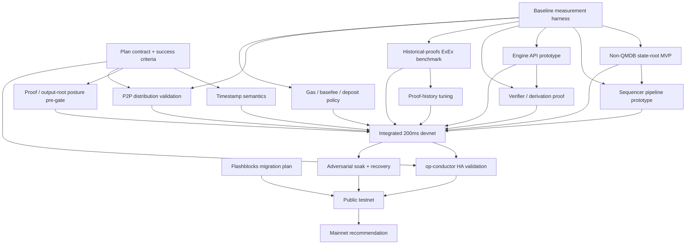

# 200ms Block Time — Baseline Execution Plan

## Purpose

This document assumes we are already aligned on the objective: **ship native canonical 200ms blocks if the system can support them safely and credibly**.

The goal here is not to re-argue the strategy. The goal is to make execution clear:

- what we need to do next,
- what the hard gates are,
- what work can run in parallel,
- how much work this likely is,
- and what order we should do it in.

## Current baseline

- We are aligned on pursuing native 200ms blocks.
- We are **not** yet committed to direct mainnet 200ms versus a staged rollout.
- We should treat **QMDB as an escalation path**, not the default critical path.
- We should treat **2D nonces / concurrent lanes** as strategically important but **not blocking** for native 200ms.
- The immediate goal of Q2 is **de-risking the true blockers**, not pretending the whole effort is done once the first prototypes land.
- On the proof side, the near-term concern is **not** that proving itself suddenly becomes fully synchronous. The near-term concern is that, with **reth as the only client**, the **historical-proofs ExEx / proof-serving path** must stay close enough to tip and recover from lag under 200ms cadence.

## What success looks like

At the end of this work, we should be able to answer seven questions with evidence, not intuition:

1. **Can we define semantically safe 200ms blocks?**
2. **Can the sequencer/state-root path actually fit inside the cadence budget?**
3. **Can op-node, EL, and verifiers keep up at 5 Hz without unhealthy lag?**
4. **Can the supported follower/distribution topology keep up at 5 Hz without permanently lagging the unsafe head?**
5. **Can the reth historical-proofs ExEx stay within bounded lag and catch up after downtime/backlog at 200ms blocks?**
6. **Can the proof/output-root/security posture remain credible for mainnet?**
7. **Can we migrate external consumers off Flashblocks cleanly enough to ship?**

If the answer to any of those is no, the correct output is **staged rollout** or **no shipment yet** — not wishful execution.

## Plan structure

The work should be managed in four phases:

1. **Phase 0 — Lock the rules**
   - define success criteria
   - measure the current system
   - resolve the highest-risk semantic and security questions early

2. **Phase 1 — Prove 5 Hz viability beyond the sequencer box**
   - state-root path
   - sequencer pipeline
   - Engine API / verifier throughput
   - follower distribution / proof-serving behavior

3. **Phase 2 — Integrate and harden**
   - gas/basefee/deposit policy
   - combined devnet
   - adversarial testing
   - HA / rollout readiness
   - external readiness

4. **Phase 3 — Rollout decision**
   - public testnet
   - mainnet recommendation

## Hard gates

These are the gates that can redirect or kill the effort.

### Gate 1 — Plan contract
We need a single written definition of what “native 200ms” means for this effort.

Must include:
- target cadence and candidate p95/p99 SLO bounds
- unsafe lag / replay / recovery SLO bounds
- what counts as acceptable verifier lag
- what counts as acceptable **proof-serving lag**
- what follower/distribution topology we are willing to support for launch
- failover / HA SLOs for the sequencer path
- what proof posture is required for mainnet
- whether direct mainnet 200ms is assumed or must be earned

### Gate 2 — Timestamp semantics
We need a final position on same-second blocks and the compatibility blast radius.

This is the highest semantic risk because it touches deployed contracts, tooling, and downstream assumptions.

### Gate 3 — Non-QMDB core 5 Hz viability
We need to prove or kill the non-QMDB path first.

That means proving that a pipelined/deferred/optimized MPT path can hit the agreed SLO bounds under realistic profiles before we let QMDB become the default answer.

### Gate 4 — Historical-proofs ExEx viability
We need an explicit answer to whether the **reth historical-proofs ExEx / proof-serving path** can live with 200ms blocks.

This is a distinct gate because:
- proving may be largely asynchronous,
- but proof serving is still a shipping requirement,
- and with **reth as the only client**, there is no alternate client escape hatch if this path falls behind.

This gate must cover:
- same-gas-per-second benchmarking at 200ms blocks,
- block-processing write overhead,
- prune behavior,
- verification-interval overhead,
- latest-vs-tip lag,
- and catch-up time after induced backlog or downtime.

### Gate 5 — Distribution / P2P viability
We need a supported distribution story for 200ms blocks.

This is not just “can we initiate gossip quickly from the sequencer.” It is “can the supported follower topology receive and advance the unsafe head within the agreed SLO bounds at 5 Hz?”

If plain P2P gossip is not sufficient, we need to explicitly decide whether launch depends on direct peering, streaming, or some other supported topology.

### Gate 6 — HA / op-conductor rollout readiness
We need explicit proof that the sequencer HA solution can support 200ms blocks without turning failover into empty-block theater.

This is a **rollout gate**, not the first lab-viability gate. It must cover:
- leader transfer time,
- empty-block behavior during failover,
- raft publish / replication latency,
- payload-size sensitivity,
- and stability under sustained 200ms load.

### Gate 7 — Proof / security posture
We need an explicit mainnet posture from the proof/output-root side.

The right framing here is:
- raw proving may remain mostly asynchronous,
- but the output-root / dispute / proof-serving model still needs a formal signoff,
- and any dependence on the reth proof-serving path must be made explicit in the final posture.

## Specific concerns that must be hammered out explicitly

### P2P / distribution
- `native-200ms-blocks.md` already gives only **10ms** for gossip initiation in the 200ms budget.
- The existing risk register already states that if **P2P gossip latency > 200ms**, followers are always behind.
- The plan therefore needs to measure **end-to-end follower lag**, not just sequencer-side initiation time.
- The output must be a concrete shipping posture: plain gossip, direct peering, streaming, or a hybrid.

### Historical-proofs ExEx / reth-only proof serving
- The current proofs-history path is asynchronous, which is good, but that does **not** mean it is free.
- The hot path still writes versioned trie/state data for each committed block and has prune / verification / catch-up behavior that must be benchmarked under 200ms cadence.
- The current configuration defaults were designed around **2s blocks**; they should not be assumed to be correct at 200ms.
- Because reth is the only client, this is not just a “nice to have for infra” concern — it is part of the shipping story.

### op-conductor / sequencer HA
- The main concerns are not abstract “HA is hard” concerns. They are concrete performance costs:
  - JSON-RPC serialization / deserialization into conductor,
  - raft publish size and replication latency,
  - current raft-backend commit / fsync behavior,
  - multi-AZ round-trip latency,
  - leader flapping,
  - and empty-block bursts during failover.
- Local benchmark data already suggests the path is sensitive to payload size, and compression helps, but that only narrows the problem. It does not eliminate the need for an explicit rollout gate.

## Workstreams

The table below is the real execution backbone.

> Effort is rough **engineering effort**, not guaranteed calendar time. Calendar duration will be longer because several workstreams run in parallel and require cross-team review.

| Workstream | Phase | Suggested owner | Rough effort | Depends on | Exit criterion |
|---|---|---|---:|---|---|
| Plan contract + success criteria | 0 | Architecture / leadership | 0.5–1.0 weeks | none | ADR defines cadence target, recovery SLO bounds, proof-serving lag SLO bounds, supported topology assumptions, HA SLOs, and allowed rollout outcomes |
| Baseline measurement harness | 0 | EL / sequencer | 1–2 weeks | none | timing artifact for empty, normal, trading-burst, deposit-heavy, recovery-replay, and same-gas/sec-at-200ms profiles |
| Timestamp semantics + compatibility matrix | 0 | Protocol / architecture | 2–3 weeks | plan contract | approved ADR and compatibility matrix for TWAP/oracles, vesting, governance, bridges, explorers, RPC, and searchers |
| Proof / output-root posture pre-gate | 0 | Proof / security | 1–2 weeks | plan contract | explicit initial verdict on output-root/dispute posture and what remains asynchronous vs shipping-critical |
| Non-QMDB state-root MVP | 1 | EL / state | 3–5 weeks | baseline measurement | explicit APPROVE / REJECT on pipelined or deferred non-QMDB path |
| Sequencer pipeline prototype | 1 | EL / sequencer | 4–6 weeks | baseline measurement, state-root direction | prototype shows block build can overlap commit/state-root work without breaking recovery invariants |
| Engine API fast path / batching prototype | 1 | EL + op-node | 2–4 weeks | baseline measurement | measured reduction in per-block fixed cost or per-block call tax |
| Verifier / derivation throughput proof | 1 | op-node / protocol | 3–5 weeks | baseline measurement, Engine API prototype | bounded verifier lag and acceptable catch-up / recovery behavior at 5 Hz |
| Historical-proofs ExEx benchmark + catch-up | 1 | Reth / proofs | 2–4 weeks | baseline measurement | same-gas/sec 200ms benchmark completed; write/prune overhead measured; latest-vs-tip lag and backlog-drain time within the agreed SLO bounds |
| Proof-history window / prune / verification tuning | 1 | Reth / proofs | 1–2 weeks | ExEx benchmark | 200ms window, prune interval, verification interval, and storage posture frozen for testnet |
| P2P distribution validation + topology decision | 1 | Networking / op-node | 2–3 weeks | baseline measurement | supported topology chosen and end-to-end follower lag measured against the shipping SLO bounds |
| Gas / basefee / deposit policy | 2 | Protocol / economics | 1–2 weeks | baseline measurement | written parameter memo and simulation results for chosen initial policy |
| op-conductor HA performance + failover validation | 2 | Infra / sequencer | 2–4 weeks | integrated devnet, topology decision | failover SLO met under sustained 200ms load with acceptable empty-block behavior |
| Flashblocks consumer inventory + migration plan | 2 | Infra / partner eng | 1–2 weeks | none | complete consumer inventory, shim/deprecation plan, and named owners for partner migrations |
| Integrated 200ms devnet | 2 | Cross-team | 2–3 weeks | timestamp, state-root, sequencer, Engine API, verifier, ExEx, and distribution tracks | combined environment running the chosen path end-to-end |
| Adversarial soak + recovery campaign | 2 | Cross-team / SRE | 2–3 weeks | integrated devnet, op-conductor track | soak report covers burst, deposit-heavy, lag, restart, replay, distribution slowdown, and failover scenarios |
| Public testnet validation | 3 | Cross-team / partner eng | 2–4 weeks | soak complete, migration plan ready, distribution gate green | external consumers validate the path and blocking issues are triaged |
| Mainnet recommendation | 3 | Architecture / leadership | 0.5–1.0 weeks | public testnet, HA gate | explicit recommendation: direct 200ms, staged rollout, or no-ship-yet |

## Work ordering

### Phase 0 — Lock the rules (start immediately)

This phase answers: **what are we trying to prove, and what would disqualify the path early?**

Priority order:
1. plan contract + success criteria
2. baseline measurement harness
3. timestamp semantics + compatibility matrix
4. proof / output-root posture pre-gate

Notes:
- Steps 1 and 2 should begin immediately.
- The plan contract should set not just latency targets, but also the launch assumptions for follower topology, proof-serving lag, and HA behavior.
- Timestamp semantics should start as soon as the plan contract is drafted; it does not need to wait for every measurement.
- Proof / output-root posture should move early enough that we do not burn a quarter on performance work only to discover the mainnet security posture is unacceptable.

### Phase 1 — Prove 5 Hz viability beyond the sequencer box

This phase answers: **can the system actually sustain 200ms cadence, not just on the sequencer box, but across the surrounding paths that matter for launch?**

Parallel tracks:
- non-QMDB state-root MVP
- sequencer pipeline prototype
- Engine API fast path / batching prototype
- verifier / derivation throughput proof
- historical-proofs ExEx benchmark + catch-up
- P2P distribution validation + topology decision

This is the real center of gravity of the work.

If this phase fails, everything after it should be reduced to:
- staged rollout,
- target relaxation,
- or escalation to QMDB.

### Phase 2 — Integrate and harden

This phase answers: **does the chosen path hold together as a real system?**

Tracks:
- gas / basefee / deposit policy
- proof-history window / prune / verification tuning
- Flashblocks migration plan
- integrated 200ms devnet
- op-conductor HA validation
- adversarial soak + recovery campaign

This is where we stop proving isolated components and start proving operability.

### Phase 3 — Rollout decision

This phase answers: **should we ship, and how?**

Tracks:
- public testnet validation
- mainnet recommendation

Allowed outcomes:
- direct mainnet 200ms
- staged rollout (for example 1s/500ms → 200ms)
- do not ship yet

## Dependency view

## Critical path

The likely critical path is:

1. Plan contract
2. Baseline measurement
3. Timestamp semantics
4. Non-QMDB state-root direction
5. Sequencer pipeline + Engine API / verifier path
6. Historical-proofs ExEx viability
7. Integrated devnet
8. Adversarial soak
9. Public testnet
10. Mainnet recommendation

Notes:
- **Proof / output-root posture** remains a hard side-gate that must stay green as the effort advances.
- **P2P / distribution** is now an explicit ship gate, not just a buried risk.
- **op-conductor HA** is now an explicit rollout gate: it may not dominate lab viability, but it can still block launch.

## Q2 plan

Q2 should be treated as the **de-risking quarter**, not the quarter where we assume the whole effort ships.

### Q2 must-complete items

- Plan contract + success criteria
- Baseline measurement harness
- Timestamp semantics ADR + compatibility matrix
- Proof / output-root posture pre-gate
- Non-QMDB state-root MVP verdict
- Sequencer pipeline prototype
- Engine API fast path / batching prototype
- Verifier / derivation throughput proof
- Historical-proofs ExEx benchmark + catch-up
- Proof-history window / prune / verification tuning recommendation
- P2P distribution baseline + supported-topology decision
- Initial gas / basefee / deposit policy
- op-conductor HA SLO draft + risk characterization
- Flashblocks consumer inventory and transition direction

### Q2 expected output

By the end of Q2, we should know:

- whether native 200ms is still a credible target this year,
- whether the non-QMDB path is viable,
- whether the supported follower topology is credible for launch,
- whether the reth proof-serving path can stay close enough to tip and recover from lag,
- whether op-conductor needs tuning only or deeper architectural changes,
- whether a direct mainnet jump is even on the table,
- and whether the project is still an execution effort or has become a deeper architectural rewrite.

## QMDB escalation rules

QMDB should become critical-path **only if** the non-QMDB route fails against agreed criteria.

Escalate QMDB if one or more of the following happen:

- the non-QMDB path misses the agreed SLO bounds under trading-burst or deposit-heavy load after focused optimization passes,
- MDBX commit behavior produces structural cadence spikes that the sequencer path cannot absorb,
- restart / replay behavior on the non-QMDB path exceeds the agreed recovery SLO bounds,
- or the non-QMDB state-root path introduces unacceptable complexity or fragility relative to the benefit.

Do **not** escalate to QMDB just because the historical-proofs ExEx or proof-history defaults need tuning. First prove whether the current non-QMDB state path and the reth proof-serving path can be made to work within the contract.

If those triggers are not hit, QMDB stays a parallel long-term state-commitment track.

## Immediate next steps

If we were starting this work this week, the next moves should be:

1. Draft and review the plan contract / success criteria ADR, including supported topology, proof-serving lag, and failover SLOs.
2. Land the measurement harness for the 2s path and define the required load profiles, including same-gas/sec-at-200ms.
3. Start the timestamp semantics ADR and compatibility matrix in parallel.
4. Write the proof / output-root pre-gate questions and define what counts as a red flag.
5. Choose the first non-QMDB MVP hypothesis to test.
6. Map the current op-node ↔ EL call path and choose the first Engine API reduction prototype.
7. Define the historical-proofs ExEx benchmark: block write cost, prune cost, verification-interval cost, latest-vs-tip lag, and backlog-drain time.
8. Define the P2P distribution experiments and the supported-topology decision criteria.
9. Inventory Flashblocks consumers so migration work is not discovered late.
10. Write the op-conductor failover SLO and the test matrix for payload-size sensitivity, raft latency, and empty-block behavior.

## Risks to keep visible

- Timestamp semantics turns into the true blocker.
- We prove a fast sequencer but not a healthy verifier path.
- We prove a fast sequencer but not a healthy **proof-serving** path.
- Follower distribution only works for privileged topology, not for the topology we actually want to support.
- The historical-proofs ExEx accumulates lag or prune stalls under 200ms same-gas/sec load.
- op-conductor adds enough failover pain that 200ms becomes operationally fragile.
- Proof / output-root posture turns the effort into testnet-only.
- QMDB quietly becomes default because the non-QMDB path was not pushed hard enough.
- Migration work gets discovered too late and turns a viable core path into a shipping delay.

## Bottom line

This is a **multi-track execution plan**, not a simple optimization project.

The right posture is:

- use Q2 to de-risk the true blockers,
- keep the non-QMDB path as the default until evidence says otherwise,
- force the system to prove 5 Hz end-to-end,
- make distribution, proof-serving, and HA explicit instead of implicit,
- and earn direct mainnet 200ms only if the gates actually clear.
