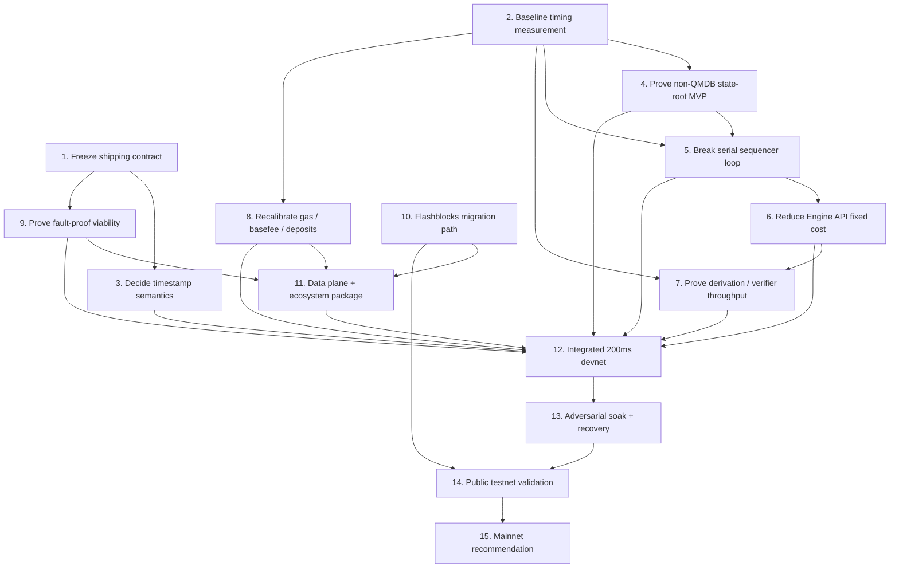

# First-Principles Plan to Achieve Native 200ms Block Time

## Goal

Ship **native canonical 200ms blocks** this year in a way that improves **trustworthy realtime trading execution** and reduces the need for Base-specific Flashblocks integrations.

This is **not** a plan to preserve Flashblocks as a brand, maximize benchmark TPS, or force QMDB into the critical path. It is a plan to make Base feel **instant, reliable, and standard enough** for serious trading teams.

## Why this is the right target

- Q2 strategy says Base should win by making trading apps feel **instant, reliable, programmable, and safe** (`projects/work/2026/q2/notes/Q2.md`).
- Q2 prioritization says the goal is **predictable realtime execution**, not Flashblocks expansion (`projects/work/2026/q2/plans/prioritize-q2.md`).
- MM feedback explicitly asks to **get rid of Flashblocks and bundles** because they are custom Base-only burden, and directly points toward **native 200ms blocks** (`knowledge/references/TRADING.md`).

## Primary inputs

- `projects/work/2026/q2/notes/Q2.md`
- `projects/work/2026/q2/plans/prioritize-q2.md`
- `projects/work/2026/q2/plans/q2-priorities.md`
- `knowledge/references/TRADING.md`
- `knowledge/references/ENGINEERING.md`
- `projects/work/2026/200ms-blocks/plans/native-200ms-blocks.md`
- `projects/work/reth/flashblock/el-sync.md`
- `projects/work/2026/qmdb/summary.md`

These sources were used for grounding, but the plan below is organized around the **actual gating questions** rather than around any prior document structure.

## First-principles framing

At 200ms, the problem is no longer “how do we expose a fast UX primitive?” but:

1. Can the sequencer produce blocks every 200ms **without serial stalls**?
2. Can verifiers and op-node keep up at **5 Hz** without permanently lagging?
3. Can we do this **without breaking contract semantics** via timestamp changes?
4. Can the proof / output-root / safety system remain **credible**?
5. Can we migrate away from Flashblocks **without breaking partner integrations**?

If the answer to any of those is no, native 200ms is either blocked, testnet-only, or requires a staged rollout.

## Program principles

1. **Optimize for trustworthy realtime UX**, not for preserving existing Flashblocks architecture.
2. **Prove the non-QMDB path first**. QMDB is an escalation path, not the default answer.
3. **Do not let 2D nonces / concurrent lanes block 200ms**. They matter strategically, but they are a separate track.
4. **Do not write implementation code before freezing timestamp semantics and the shipping contract.**
5. **Use evidence gates** at every step: benchmark, prototype, devnet soak, public testnet validation, then mainnet recommendation.

## What is actually on the critical path

### True blockers

1. **Timestamp semantics**
2. **Sequencer pipeline / serial bottleneck removal**
3. **State-root path that fits the 200ms budget**
4. **Verifier / op-node / Engine API throughput at 5 Hz**
5. **Fault-proof and output-root viability**

### Important but not primary blockers

- Flashblocks migration / compatibility shim
- Gas / basefee / deposit policy
- RPC, indexer, explorer, bridge, wallet readiness
- Batcher and archive/storage tuning

### Explicitly off the MVP critical path unless evidence forces escalation

- Full QMDB rollout
- 2D nonces / concurrent transaction lanes
- Broader trading account roadmap (session keys, subaccounts, automation)

## Necessary steps

### Step 1 — Freeze the native-200ms shipping contract
Define exactly what “native canonical 200ms” means.

Must include:
- block production target and p95/p99 SLOs
- allowed unsafe lag / recovery envelope
- security posture and proof requirements
- explicit non-goals
- allowed rollout outcomes: direct mainnet, staged rollout, or do-not-ship-yet

Output: shipping ADR / contract document.

### Step 2 — Measure the real 2s-to-200ms budget
Instrument the current path end-to-end.

Must measure:
- block assembly
- execution
- state-root work
- DB commit
- Engine API round trips
- op-node derivation overhead
- gossip initiation
- restart / replay path

Run against at least:
- empty
- normal
- trading burst
- deposit-heavy
- recovery replay

Output: baseline timing artifact that tells us what actually dominates the budget.

### Step 3 — Decide timestamp semantics before mainline implementation
This is the first real gate.

Need a final decision on:
- same-second block behavior
- monotonicity rule
- relationship to wall clock and L1 time
- compatibility envelope for TWAPs, vesting, governance, bridges, explorers, RPC, and MEV/searchers

Default bias: **do not** adopt millisecond `block.timestamp`.

Output: timestamp ADR + compatibility matrix.

### Step 4 — Prove the non-QMDB state-root MVP path
The default question is not “how do we do QMDB?” but “can we hit 200ms with pipelined or deferred state-root handling first?”

Candidate MVP paths:
- pipelined MPT state-root computation
- deferred state-root semantics
- multiproof / cached / parallelized MPT path

Escalate to QMDB only if measured evidence says the MVP path cannot fit target envelopes under trading-burst and deposit-heavy load.

Output: explicit APPROVE / REJECT verdict for non-QMDB MVP.

### Step 5 — Break the serial sequencer loop
Move from “wait 2s, then do everything” to a pipelined loop.

Required outcomes:
- building block N+1 overlaps with commit / seal work for N
- state-root work no longer stalls the next build cycle
- restart/recovery is part of the design, not an afterthought

Output: pipelined sequencer prototype with measured before/after delta.

### Step 6 — Compress Engine API fixed cost
At 5 Hz, per-block request/response overhead becomes a real tax.

Prototype one or both:
- fast path for sequencer-produced blocks
- batching / streaming path between op-node and EL

Output: reduced call count and/or reduced fixed per-block latency.

### Step 7 — Prove verifier and derivation throughput at 5 Hz
This is a separate hard gate from the sequencer path.

Need evidence that:
- derivation pipeline can handle 10x more block boundaries
- EL sync / verifier catch-up does not fall behind permanently
- restart / unsafe-head recovery is acceptable

Output: throughput report for steady-state, catch-up, and recovery scenarios.

### Step 8 — Recalibrate gas, basefee, and deposit handling
200ms means the economics and ingestion model change.

Need decisions on:
- initial gas target per block
- basefee denominator / elasticity to avoid pathological volatility
- deposit smoothing / capping / special handling so one heavy deposit block does not destroy cadence

Output: parameter memo + simulation artifacts.

### Step 9 — Prove fault-proof and output-root viability
This is the security gate.

Need explicit modeling of:
- output-root cadence
- challenger/proposer load
- challenged range size
- runtime / cost / operability of disputes under 200ms assumptions

Output: proof-viability memo with one of: **mainnet approved**, **testnet only**, or **reject**.

### Step 10 — Build the Flashblocks migration path
Do not leave partners stranded.

Need:
- inventory of all Flashblocks consumers
- migration / shim story for critical consumers
- deprecation plan for Base-specific APIs

Output: compatibility shim and deprecation plan.

### Step 11 — Package the data plane and ecosystem envelope
Lock the supporting surfaces required for real operation.

Includes:
- batcher cadence and span-batch sizing
- RPC / subscription behavior
- EIP-2935 history window decision
- archive/storage growth posture
- wallet / bridge / indexer / explorer expectations

Output: data-plane and ecosystem compatibility package.

### Step 12 — Stand up an integrated 200ms devnet
Combine the approved pieces into one environment.

Must exercise:
- chosen timestamp semantics
- chosen state-root path
- chosen EL/op-node path
- chosen gas/basefee/deposit rules
- chosen proof/output cadence

Output: documented integrated devnet runbook.

### Step 13 — Run adversarial soak and recovery campaigns
The chain must survive the failure modes that matter.

Must include:
- steady-state trading load
- burst load
- deposit-heavy blocks
- follower lag
- sequencer restart / replay
- reorg / reset paths
- component slowdown

Output: soak report with explicit failures and mitigations.

### Step 14 — Public testnet validation with real consumers
Validate with infra operators, trading partners, and compatibility consumers.

Must collect:
- partner-reported blockers
- severity and owner for each blocker
- migration readiness for Flashblocks consumers

Output: public-testnet validation report.

### Step 15 — Make the mainnet recommendation
Only after evidence exists.

Allowed outcomes:
- **Direct mainnet 200ms**
- **Staged rollout: 500ms/1s → 200ms**
- **Do not ship yet**

Output: final go/no-go memo with rollback posture.

## Dependency graph

## Unblocker matrix

| Step | Unblocks |
|---|---|
| 1. Shipping contract | timestamp decision, proof gate, rollout criteria |
| 2. Baseline timing | state-root choice, sequencer work, verifier work, gas/deposit policy |
| 3. Timestamp semantics | integrated devnet, ecosystem compatibility, any credible rollout |
| 4. Non-QMDB MVP verdict | whether 200ms can ship this year without full QMDB |
| 5. Sequencer pipeline | Engine API optimization, integrated devnet |
| 6. Engine API fast path | verifier/op-node throughput, integrated devnet |
| 7. Verifier throughput | safe rollout, proof/data-plane confidence |
| 8. Gas/basefee/deposit policy | realistic integrated testing |
| 9. Fault-proof viability | security-acceptable mainnet plan |
| 10. Flashblocks migration | partner readiness and deprecation |
| 11. Data plane / ecosystem package | integrated environment and external validation |
| 12. Integrated devnet | soak testing |
| 13. Adversarial soak | public testnet confidence |
| 14. Public testnet | final mainnet recommendation |

## Recommended sequencing by quarter

### Q2: de-risk the true blockers

Q2 should focus on the work that decides whether 200ms is real this year.

Must finish in Q2:
- Step 1 — shipping contract
- Step 2 — baseline measurement
- Step 3 — timestamp semantics
- Step 4 — non-QMDB state-root MVP verdict
- Step 5 — serial sequencer prototype
- Step 6 — Engine API prototype
- Step 7 — verifier/derivation throughput proof
- Step 8 — gas/basefee/deposit policy
- Step 9 — fault-proof viability model at least to the point of a hard gate
- Step 10 — Flashblocks dependency inventory and transition direction

This aligns with Q2 strategy: prioritize reliable realtime execution, simplify partner pain, and keep QMDB from swallowing the quarter.

### Later this year: integrate, validate, and decide

After Q2, assuming the hard gates are positive:
- Step 11 — package the data plane and ecosystem envelope
- Step 12 — integrated devnet
- Step 13 — adversarial soak
- Step 14 — public testnet validation
- Step 15 — mainnet recommendation / rollout

## Recommendation on QMDB

QMDB should remain a **shadow-track escalation path**, not the default program plan.

Make it critical-path only if measured evidence shows:
- pipelined / deferred / optimized MPT cannot meet target under realistic load, or
- MDBX commit behavior creates unavoidable cadence spikes, or
- recovery / replay under the non-QMDB path is unacceptable.

Otherwise:
- ship a non-QMDB MVP path first,
- keep QMDB as the long-term state-commitment simplification / performance program.

## Recommendation on rollout posture

Default posture should be:

1. prove direct 200ms in lab/devnet,
2. validate with public testnet,
3. then choose between:
   - direct mainnet 200ms,
   - staged 500ms/1s → 200ms,
   - or do not ship yet.

Do **not** commit in advance to direct mainnet 200ms.

## Bottom line

The year’s 200ms program should be organized around five truth-seeking gates:

1. **Can we define semantically safe 200ms blocks?**
2. **Can we fit the sequencer/state-root path into the budget without forcing QMDB?**
3. **Can verifiers and op-node keep up at 5 Hz?**
4. **Can the proof system stay security-credible?**
5. **Can we migrate the ecosystem off Flashblocks cleanly?**

If those gates clear, native 200ms is credible this year. If they do not, the correct answer is staged rollout or no shipment — not wishful execution.
