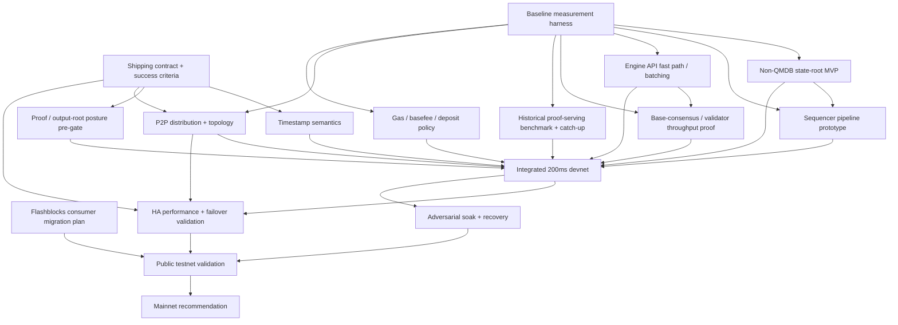

# 200ms Block Time — Baseline Execution Plan

## Purpose

> Bottom line: Native 200ms blocks are the clearest path to preserve Flashblocks-class UX in the protocol itself, remove a large part of the current Base-specific interaction burden, and satisfy a large share of the execution and scaling work that matters most this year.

This document assumes we are already aligned on the objective: ship native canonical 200ms blocks if the system can support them safely and credibly.

Why this matters, briefly:

- Trading and realtime UX: Base wins by becoming the best place to build real-time, programmable, always-on market apps, and that the priority is reliable realtime execution, not generic speed claims.
- Simplification: Trading feedback is explicit that Flashblocks is a custom Base-only burden. Native 200ms blocks are the cleanest path toward making fast execution feel more standard and less special-case.
- Scaling impact: A 10× cadence reduction (with matching gas/sec discipline) absorbs a large fraction of the throughput, latency, and inclusion-predictability work.

The goal is to make clear:

- what must be true to ship direct mainnet 200ms,
- what the hard gates are,
- what work clears those gates,
- and what needs to happen next.

## State of the world

- We are aligned on pursuing native 200ms blocks.
- We are **targeting direct mainnet 200ms**. Anything slower is a UX regression versus Flashblocks today, so it is not an acceptable default outcome for this plan.
- We should treat **QMDB as an escalation path**, not the default critical path.
- The immediate goal of Q2 is **de-risking the true blockers** listed below.
- On the proof side, **multiprover proof generation** largely runs off the hot path. The near-term concern is that, with **reth as the only client**, the historical proof-serving path must stay close enough to tip and recover from lag under 200ms cadence.

## What success looks like

Success means we can ship **direct mainnet 200ms** with evidence — not intuition — that the system holds up end-to-end at 200ms across the sequencer path, the validator / base-consensus path, follower distribution, proof serving, and the existing ecosystem.

The detailed bar for each of those is defined in **Hard gates** below. Anything that misses its gate means direct mainnet 200ms is not ready to ship.

## How to read this plan

This plan is organized around the decisions and work that determine whether direct mainnet 200ms is credible.

- **Hard gates** define what must be true to ship.
- **Workstreams** define the concrete bodies of work needed to clear those gates.
- **Dependency view** shows what unblocks what.
- **Critical path** shows what must go right in order.
- **Q2 plan** and **Immediate next steps** translate that into near-term execution.

## Hard gates

These are the gates that decide whether direct mainnet 200ms is credible.

### Gate 1 — Shipping contract

A single written definition of what shipping native 200ms means.

It must lock:

- block-building SLOs,
- recovery / failover SLOs,
- acceptable validator lag and **proof-serving lag**,
- **empty-block SLO**,
- supported follower topology,
- and required mainnet proof posture.

### Gate 2 — Timestamp semantics

Final decision on same-second blocks and the compatibility blast radius across contracts, tooling, and downstream consumers.

### Gate 3 — Non-QMDB core viability

Prove the non-QMDB state path can support 200ms under realistic profiles. If it cannot, QMDB becomes a real decision instead of a background option.

### Gate 4 — Block building performance

Prove the sequencer hot path consistently fits inside 200ms under realistic mempool conditions, target gas, and named load profiles. This includes transaction execution, state root computation, State DB commit, Engine API latency, mempool interaction, assembly/sealing, and gossip initiation.

### Gate 5 — Historical proof-serving viability

Prove the reth historical proof-serving path can live with 200ms blocks. **Multiprover proof generation** mostly runs off the hot path, but proof serving is still a shipping requirement, and with **reth as the only client** there is no alternate-client escape hatch if this path falls behind.

Must cover same-gas-per-second benchmarking and catch-up after backlog or downtime.

### Gate 6 — Distribution / P2P viability

Prove the supported follower topology can stay close enough to the unsafe head at 200ms. If plain gossip is insufficient, the required launch topology must be explicit.

### Gate 7 — HA / failover readiness

Prove the sequencer HA path — including op-conductor — can support 200ms without turning failover into empty-block theater. Must cover leader transfer time, failover empty-block behavior, raft latency, payload-size sensitivity, and sustained stability under load.

### Gate 8 — Proof / security posture

Establish explicit mainnet posture for output roots, disputes, and proof generation. **Multiprover proof generation** can remain off the hot path, but the overall proof/security model still needs formal signoff, and any dependence on the reth proof-serving path must be explicit.

## Workstreams

These are the concrete bodies of work required to clear the hard gates and make direct mainnet 200ms credible.

| Workstream                                    | Exit criteria                                                                                                                                                                         | Phase | Depends on                                                                |
| --------------------------------------------- | ------------------------------------------------------------------------------------------------------------------------------------------------------------------------------------- | ----- | ------------------------------------------------------------------------- |
| Shipping contract + success criteria          | Written shipping contract defines block building SLOs, recovery / failover SLOs, proof-serving lag limits, empty-block policy, supported topology, and required mainnet proof posture | 0     | none                                                                      |
| Baseline measurement harness                  | Benchmark results exist for empty, normal, trading-burst, deposit-heavy, recovery, and same-gas/sec-at-200ms profiles                                                                 | 0     | none                                                                      |
| Timestamp semantics + compatibility matrix    | Written timestamp design and compatibility matrix are complete for existing contracts, bridges, explorers, RPC, and searchers                                                         | 0     | shipping contract                                                         |
| Proof / output-root posture pre-gate          | Clear initial verdict exists on output-root / dispute posture for native 200ms                                                                                                        | 0     | shipping contract                                                         |
| Non-QMDB state-root MVP                       | Determine if existing MPT state root path fits our perf requirement under 200ms block time                                                                                            | 1     | baseline measurement                                                      |
| block building pipeline optimization          | Block building path consistently fits inside the 200ms budget under named load profiles, with recovery invariants intact                                                              | 1     | baseline measurement, Non-QMDB state-root direction                       |
| Engine API fast path / batching               | Single Base Binary => Per-block fixed overhead is reduced enough to support 200ms cadence                                                                                             | 1     | baseline measurement                                                      |
| Base-consensus / validator throughput proof   | Validator / consensus path stays within lag and catch-up SLOs at 200ms                                                                                                                | 1     | baseline measurement, Engine API prototype                                |
| Historical proof-serving benchmark + catch-up | Historical proof serving stays within lag bounds, catches up after backlog, and proves the current path is viable for shipping                                                        | 1     | baseline measurement                                                      |
| P2P distribution + topology decision          | Supported topology is chosen and follower lag stays within shipping SLOs                                                                                                              | 1     | baseline measurement                                                      |
| Gas / basefee / deposit policy                | Initial 200ms policy is frozen with supporting simulation or benchmark evidence                                                                                                       | 2     | baseline measurement                                                      |
| HA performance + failover validation          | Failover stays within SLOs and does not create unacceptable empty-block behavior                                                                                                      | 2     | integrated devnet, P2P topology decision                                  |
| Flashblocks consumer migration plan           | Consumer inventory, migration path, and deprecation/shim plan are complete                                                                                                            | 2     | none                                                                      |
| Integrated 200ms devnet                       | Full chosen path runs end-to-end in one environment                                                                                                                                   | 2     | Phase 1 workstreams                                                       |
| Adversarial soak + recovery campaign          | Soak results cover burst, deposit-heavy, lag, restart, replay, distribution slowdown, and failover scenarios                                                                          | 2     | integrated devnet, HA validation                                          |
| Public testnet validation                     | External consumers validate the path and all blockers are triaged                                                                                                                     | 3     | adversarial soak + recovery campaign, Flashblocks consumer migration plan |
| Mainnet recommendation                        | Final recommendation is either direct mainnet 200ms or do not ship yet                                                                                                                | 3     | public testnet validation                                                 |

> **Phase notes:**
>
> - **Phase 0:** shipping contract and baseline measurement start immediately; everything else depends on them. Move proof / output-root posture early enough to avoid burning a quarter on performance work before discovering the mainnet security posture is unacceptable.
> - **Phase 1** is the center of gravity. If it fails, the response is escalation to QMDB or no shipment yet.
> - **Phase 3** ships only direct mainnet 200ms or returns "do not ship yet."

## Dependency view

This shows the minimum unblock relationships between workstreams.

## Critical path

The critical path to direct mainnet 200ms is:

1. Shipping contract
2. Baseline measurement
3. Timestamp semantics
4. Non-QMDB state-root direction
5. Sequencer pipeline + Engine API + validator path
6. Historical proof-serving viability
7. Integrated devnet
8. Adversarial soak
9. Public testnet
10. Mainnet recommendation

Notes:

- **Proof / output-root posture** remains a hard side-gate that must stay green as the effort advances.
- **op-conductor HA** is now an explicit rollout gate: it may not dominate viability, but it can still block launch.

## Q2 plan

Q2 is the de-risking quarter for direct mainnet 200ms.

### Q2 must-complete outputs

#### Decisions

- Shipping contract + success criteria
- Written timestamp decision + compatibility matrix

#### Measurements

- Baseline measurement harness
- Base-consensus / validator throughput proof
- Historical proof-serving benchmark + catch-up
- P2P distribution baseline + topology decision
- Initial gas / basefee / deposit policy

#### Prototypes

- Non-QMDB state-root MVP verdict
- Engine API fast path / batching

#### Launch-risk characterization

- HA failover SLO draft + risk characterization
- Flashblocks consumer inventory and transition direction

### Q2 expected output

By the end of Q2, we should know:

- whether direct mainnet 200ms is credible this year,
- whether the non-QMDB path is viable,
- whether the supported follower topology is launchable,
- whether the historical proof-serving path can stay close enough to tip and recover from lag,
- whether HA / failover needs tuning only or deeper change,
- and whether the remaining launch risks are now known and bounded.

## QMDB escalation rules

QMDB should become critical-path **only if** the non-QMDB route fails against shipping SLOs.

Pull QMDB forward only if one or more of the following happen:

- the non-QMDB path cannot hit 200ms SLOs under realistic load after focused optimization,
- commit or replay behavior is structurally incompatible with the required recovery SLOs,
- or the non-QMDB state path is too fragile or complex to ship.

Do **not** escalate to QMDB just because the historical proof-serving path or its retention defaults need tuning. First prove whether the current non-QMDB state path and the reth proof-serving path can be made to work within the contract.

If those triggers are not hit, QMDB stays a parallel long-term state-commitment track.

## Immediate next steps

If we were starting this work this week, the next moves should be:

1. Freeze the written shipping contract, including empty-block policy, topology, proof-serving lag, and failover SLOs.
2. Land the baseline measurement harness and define same-gas/sec-at-200ms profiles.
3. Freeze the timestamp decision + compatibility matrix.
4. Write the proof / output-root pre-gate questions and red-flag criteria.
5. Choose and benchmark the first non-QMDB MVP hypothesis.
6. Single base binary to avoid engine API overhead.
7. Define the historical proof-serving benchmark and catch-up tests.
8. Define the P2P / topology and HA / failover experiments, then inventory Flashblocks consumers.

## Risks to keep visible

- **Semantics:** timestamp decisions break deployed assumptions.
- **Hot path:** the sequencer build path does not reliably fit inside 200ms under realistic load.
- **Validator / consensus path:** base-consensus falls behind or fails to recover cleanly.
- **Proof serving:** the historical proof-serving path accumulates lag or stalls under 200ms same-gas/sec load.
- **Distribution:** the topology we actually want to support cannot stay close enough to the unsafe head.
- **HA / failover:** op-conductor creates too much instability or too many empty blocks during failover.
- **Proof / security:** mainnet proof posture is weaker or narrower than expected.
- **Escalation drift:** QMDB gets pulled onto the critical path without enough evidence.
- **Migration:** Flashblocks consumer work is discovered too late and becomes the launch blocker.

