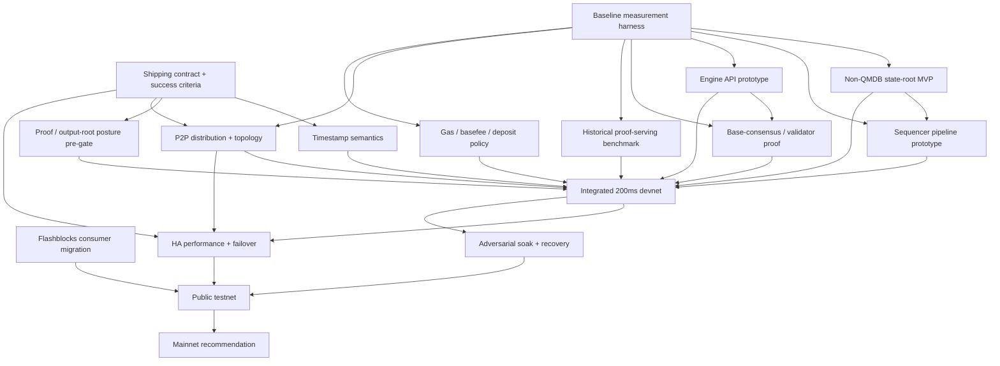

# 200ms Block Time — Baseline Execution Plan

## Purpose

> Bottom line: Native 200ms blocks are the biggest single lever for delivering Base’s realtime execution roadmap this year. They replace a large part of the current Flashblocks-specific interaction model with native protocol behavior, materially improve trustworthy realtime trading UX, and cover a meaningful chunk of the scaling work that matters most right now — without forcing QMDB or parallel-lane work onto the MVP critical path.

This document assumes we are already aligned on the objective: ship native canonical 200ms blocks if the system can support them safely and credibly.

Why this matters, briefly:

- Trading and realtime UX: Base wins by becoming the best place to build real-time, programmable, always-on market apps, and that the priority is reliable realtime execution, not generic speed claims.
- Simplification: Trading feedback is explicit that Flashblocks is a custom Base-only burden. Native 200ms blocks are the cleanest path toward making fast execution feel more standard and less special-case.
- Scaling impact: A 10× cadence reduction (with matching gas/sec discipline) absorbs a large fraction of the throughput, latency, and inclusion-predictability work.

The goal here is not to re-argue the strategy. The goal is to make execution clear:

- what we need to do next,
- what the hard gates are,
- what work can run in parallel,
- how much work this likely is,
- and what order we should do it in.

## Working assumptions

- We are aligned on pursuing native 200ms blocks.
- We are **targeting direct mainnet 200ms**. A staged rollout (e.g. 1s → 500ms → 200ms) would be a UX regression versus Flashblocks today, so it is not the default outcome. Staging is only acceptable if a hard gate forces it.
- We should treat **QMDB as an escalation path**, not the default critical path.
- The immediate goal of Q2 is **de-risking the true blockers**, not pretending the whole effort is done once the first prototypes land.
- On the proof side, the near-term concern is **not** that proving itself suddenly becomes fully synchronous. The near-term concern is that, with **reth as the only client**, the **historical-proofs ExEx / proof-serving path** must stay close enough to tip and recover from lag under 200ms cadence.

## What success looks like

Success means we can ship **direct mainnet 200ms** with evidence, not intuition, that the system holds up end-to-end at 5 Hz — across the sequencer, the validator path, follower distribution, proof serving, and the existing ecosystem.

The detailed bar for each of those is enumerated in **Hard gates** below. Anything that fails its gate forces either a staged rollout (reluctantly) or no shipment yet — not wishful execution.

## Plan structure

The work is managed in four phases. Each phase has one guiding question; the detailed tracks for each phase live in **Work ordering** below.

1. **Phase 0 — Lock the rules.** What are we trying to prove, and what would disqualify the path early?
2. **Phase 1 — Prove 5 Hz viability beyond the sequencer box.** Can the system actually sustain 200ms cadence across the surrounding paths that matter for launch — not just on the sequencer box?
3. **Phase 2 — Integrate and harden.** Does the chosen path hold together as a real system?
4. **Phase 3 — Rollout decision.** Should we ship, and how?

## Hard gates

These are the gates that can redirect or kill the effort.

### Gate 1 — Shipping contract

A single written definition of what "native 200ms" means for this effort.

Must include:

- target cadence and candidate p50/p95/p99 block building SLO bounds
- unsafe lag / replay / recovery SLO bounds
- acceptable validator lag
- acceptable **proof-serving lag**
- **empty-block policy** — acceptable empty-block rate at idle and during failover, and what counts as pathological empty-block behavior
- supported follower/distribution topology for launch
- failover / HA SLOs for the sequencer path
- required mainnet proof posture

### Gate 2 — Timestamp semantics

A final position on same-second blocks and the compatibility blast radius. Highest semantic risk because it touches deployed contracts, tooling, and downstream assumptions.

### Gate 3 — Non-QMDB core viability at 200ms

Prove or kill the non-QMDB path first. A pipelined / deferred / optimized MPT path must hit the agreed SLO bounds under realistic profiles before QMDB becomes the default answer.

### Gate 4 — Block building performance

The sequencer must consistently build a block in under 200ms under realistic mempool and load conditions — not just on a clean lab box with synthetic transactions.

Distinct from Gate 3: even with a fast state-root path, the rest of the build path has to fit inside the cadence budget.

Must cover:

- transaction execution time per block under target gas
- mempool interaction cost (selection, eviction, reordering) at 200ms cadence
- block assembly + sealing time
- gossip initiation time from the sequencer
- behavior under realistic load profiles: trading-burst, deposit-heavy, idle, recovery-replay

If the sequencer hot path cannot consistently fit inside 200ms under these profiles, the rest of the stack is irrelevant.

### Gate 5 — Historical-proofs ExEx viability

Can the **reth historical-proofs ExEx / proof-serving path** live with 200ms blocks?

Distinct gate because:

- **multiprover proof generation** runs largely off the hot path,
- but proof serving is still a shipping requirement,
- and with **reth as the only client**, there is no alternate-client escape hatch if this path falls behind.

Must cover same-gas-per-second benchmarking at 200ms and catch-up time after induced backlog or downtime.

### Gate 6 — Distribution / P2P viability

A supported distribution story for 200ms blocks. Not "can we initiate gossip quickly from the sequencer" — but "can the supported follower topology receive and advance the unsafe head within the agreed SLO bounds at 200ms?"

If plain P2P gossip is not sufficient, decide explicitly whether launch depends on direct peering, streaming, or some other supported topology.

### Gate 7 — HA / op-conductor rollout readiness

Explicit proof that the sequencer HA solution can support 200ms blocks without turning failover into empty-block theater.

A **rollout gate**, not a lab-viability gate. Must cover leader transfer time, empty-block behavior during failover, raft publish / replication latency, payload-size sensitivity, and stability under sustained 200ms load.

### Gate 8 — Proof / security posture

Explicit mainnet posture from the proof/output-root side:

- **multiprover proof generation** runs largely off the hot path,
- but the output-root / dispute / proof-serving model still needs formal signoff,
- and any dependence on the reth proof-serving path must be made explicit in the final posture.

## Workstreams

These are the concrete bodies of work required to clear the hard gates and make direct mainnet 200ms credible.

| Workstream | Exit criteria | Phase | Depends on |
|---|---|---|---|
| Shipping contract + success criteria | Written shipping contract defines cadence SLOs, recovery / failover SLOs, proof-serving lag limits, empty-block policy, supported topology, and required mainnet proof posture | 0 | none |
| Baseline measurement harness | Benchmark results exist for empty, normal, trading-burst, deposit-heavy, recovery, and same-gas/sec-at-200ms profiles | 0 | none |
| Timestamp semantics + compatibility matrix | Written timestamp decision and compatibility matrix are complete for TWAP/oracles, vesting, governance, bridges, explorers, RPC, and searchers | 0 | shipping contract |
| Proof / output-root posture pre-gate | Clear initial verdict exists on output-root / dispute posture for native 200ms | 0 | shipping contract |
| Non-QMDB state-root MVP | Final APPROVE / REJECT exists for the non-QMDB path | 1 | baseline measurement |
| Sequencer pipeline prototype | Block build path consistently fits inside the 200ms budget under named load profiles, with state-root work pipelined and recovery invariants intact | 1 | baseline measurement, Non-QMDB state-root direction |
| Engine API fast path / batching | Per-block fixed overhead is reduced enough to support 200ms cadence | 1 | baseline measurement |
| Base-consensus / validator throughput proof | Validator / consensus path stays within lag and catch-up SLOs at 200ms | 1 | baseline measurement, Engine API prototype |
| Historical proof-serving benchmark + catch-up | Historical proof serving stays within lag bounds, catches up after backlog, and proves the current path is viable for shipping | 1 | baseline measurement |
| P2P distribution + topology decision | Supported topology is chosen and follower lag stays within shipping SLOs | 1 | baseline measurement |
| Gas / basefee / deposit policy | Initial 200ms policy is frozen with supporting simulation or benchmark evidence | 2 | baseline measurement |
| HA performance + failover validation | Failover stays within SLOs and does not create unacceptable empty-block behavior | 2 | integrated devnet, P2P topology decision |
| Flashblocks consumer migration plan | Consumer inventory, migration path, and deprecation/shim plan are complete | 2 | none |
| Integrated 200ms devnet | Full chosen path runs end-to-end in one environment | 2 | Phase 1 workstreams |
| Adversarial soak + recovery campaign | Soak results cover burst, deposit-heavy, lag, restart, replay, distribution slowdown, and failover scenarios | 2 | integrated devnet, HA validation |
| Public testnet validation | External consumers validate the path and all blockers are triaged | 3 | adversarial soak + recovery campaign, Flashblocks consumer migration plan |
| Mainnet recommendation | Final recommendation is either direct mainnet 200ms or do not ship yet | 3 | public testnet validation |

> **Phase notes:**
>
> - **Phase 0:** shipping contract and baseline measurement start immediately; everything else depends on them. Move proof / output-root posture early enough to avoid burning a quarter on performance work before discovering the mainnet security posture is unacceptable.
> - **Phase 1** is the center of gravity. If it fails, the response is escalation to QMDB or no shipment yet — **staged rollout is not an outcome**.
> - **Phase 3** ships only direct mainnet 200ms or returns "do not ship yet."

## Dependency view

## Critical path

The likely critical path is:

1. Shipping contract
2. Baseline measurement
3. Timestamp semantics
4. Non-QMDB state-root direction
5. Sequencer pipeline + Engine API / validator path
6. Historical proof-serving viability
7. Integrated devnet
8. Adversarial soak
9. Public testnet
10. Mainnet recommendation

Notes:
- **Proof / output-root posture** remains a hard side-gate that must stay green as the effort advances.
- **P2P / distribution** is now an explicit ship gate, not just a buried risk.
- **op-conductor HA** is now an explicit rollout gate: it may not dominate lab viability, but it can still block launch.

## Q2 plan

Q2 should be treated as the **de-risking quarter**, not the quarter where we assume the whole effort ships.

### Q2 must-complete items

- Shipping contract + success criteria
- Baseline measurement harness
- Written timestamp decision + compatibility matrix
- Proof / output-root posture pre-gate
- Non-QMDB state-root MVP verdict
- Sequencer pipeline prototype
- Engine API fast path / batching
- Base-consensus / validator throughput proof
- Historical proof-serving benchmark + catch-up
- P2P distribution baseline + topology decision
- Initial gas / basefee / deposit policy
- HA failover SLO draft + risk characterization
- Flashblocks consumer inventory and transition direction

### Q2 expected output

By the end of Q2, we should know:

- whether native 200ms is still a credible target this year,
- whether the non-QMDB path is viable,
- whether the supported follower topology is credible for launch,
- whether the reth proof-serving path can stay close enough to tip and recover from lag,
- whether op-conductor needs tuning only or deeper architectural changes,
- whether anything has emerged that would force us off direct mainnet 200ms,
- and whether the project is still an execution effort or has become a deeper architectural rewrite.

## QMDB escalation rules

QMDB should become critical-path **only if** the non-QMDB route fails against agreed criteria.

Escalate QMDB if one or more of the following happen:

- the non-QMDB path misses the agreed SLO bounds under trading-burst or deposit-heavy load after focused optimization passes,
- MDBX commit behavior produces structural cadence spikes that the sequencer path cannot absorb,
- restart / replay behavior on the non-QMDB path exceeds the agreed recovery SLO bounds,
- or the non-QMDB state-root path introduces unacceptable complexity or fragility relative to the benefit.

Do **not** escalate to QMDB just because the historical proof-serving path or its retention defaults need tuning. First prove whether the current non-QMDB state path and the reth proof-serving path can be made to work within the contract.

If those triggers are not hit, QMDB stays a parallel long-term state-commitment track.

## Immediate next steps

If we were starting this work this week, the next moves should be:

1. Draft and review the written shipping contract / success criteria doc, including supported topology, proof-serving lag, empty-block policy, and failover SLOs.
2. Land the measurement harness for the 2s path and define the required load profiles, including same-gas/sec-at-200ms.
3. Start the written timestamp decision + compatibility matrix in parallel.
4. Write the proof / output-root pre-gate questions and define what counts as a red flag.
5. Choose the first non-QMDB MVP hypothesis to test.
6. Map the current base-consensus ↔ EL call path and choose the first Engine API reduction prototype.
7. Define the historical proof-serving benchmark: write cost, lag, backlog-drain time, and recovery behavior at 200ms.
8. Define the P2P distribution experiments and topology decision criteria.
9. Inventory Flashblocks consumers so migration work is not discovered late.
10. Write the op-conductor failover SLO and the test matrix for payload-size sensitivity, raft latency, and empty-block behavior.

## Risks to keep visible

- Timestamp semantics turns into the true blocker.
- We prove a fast sequencer but not a healthy validator path.
- We prove a fast sequencer but not a healthy **proof-serving** path.
- Follower distribution only works for privileged topology, not for the topology we actually want to support.
- The historical proof-serving path accumulates lag or stalls under 200ms same-gas/sec load.
- op-conductor adds enough failover pain that 200ms becomes operationally fragile.
- Proof / output-root posture turns the effort into testnet-only.
- QMDB quietly becomes default because the non-QMDB path was not pushed hard enough.
- Migration work gets discovered too late and turns a viable core path into a shipping delay.

## Bottom line

This is a **multi-track execution plan**, not a simple optimization project.

The right posture is:

- use Q2 to de-risk the true blockers,
- keep the non-QMDB path as the default until evidence says otherwise,
- force the system to prove 200ms end-to-end,
- make distribution, proof-serving, and HA explicit instead of implicit,
- and earn direct mainnet 200ms only if the gates actually clear.
